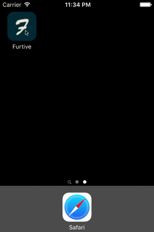

# furtive-app

> Control your computer(s) using your phone.

This application is intended to be coupled with the [Furtive server](https://github.com/Apercu/furtive-api).

### Motivations

I wanted a tool that will allow me to shutdown one or more of my computers at once, and without really bothering with configurations and knowing the local IPs. I extended this to other features that I found fun afterwards, and plan to add more, suggestions always welcome :wink:

### Installation

    npm i

###### iOS

Since I don't have an Apple Developer account, this app is not on the Store but you can deploy it manually on your phone if you have XCode 7, even without a Developer account. I'm thinking of putting it on Cydia if some people are interested.

You'll need to open the project in XCode and make sure the `Scheme` (under the Product menu) of the project is set to `Release`. You can now select your iDevice as a target and build it.

###### Android

Well, it's a work in progress.
